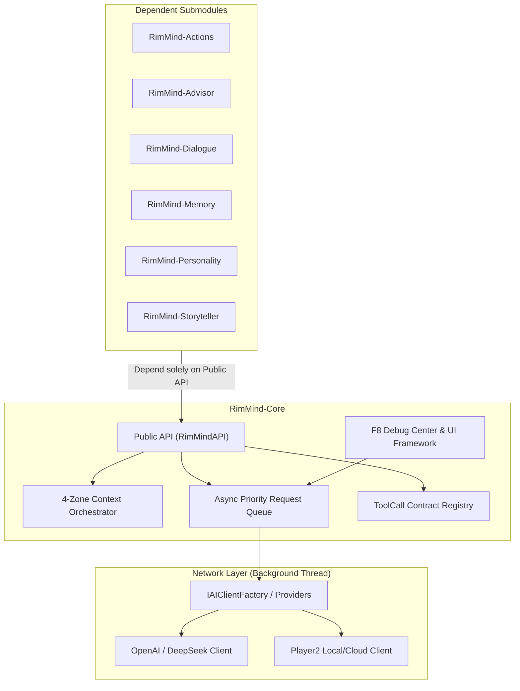

<div align="center">

# RimMind-Core 🧠
### Foundational LLM Runtime, Context Engine & ToolCall Framework for RimWorld 1.6

**English** | [简体中文](README_zh.md)

<p>
  <a href="https://rimworldgame.com/"></a>
  <a href="https://github.com/pardeike/Harmony"></a>
  <a href="https://dotnet.microsoft.com/"></a>
  <a href="#"></a>
  <a href="#"></a>
  <a href="LICENSE"></a>
</p>

<p><em>The foundational bedrock for the entire RimMind AI ecosystem.</em></p>

</div>

---

## 📖 Overview

**RimMind-Core** provides the foundational AI infrastructure and runtime environment for the RimMind mod suite. Every gameplay submodule (`Actions`, `Advisor`, `Dialogue`, `Memory`, `Personality`, `Storyteller`, `Bridges`) depends solely on the public contracts exposed by `RimMind-Core`.

### Core Capabilities
- **4-Zone KV-Cache Orchestrator**: Separates invariant world rules (Zone 1) and permanent pawn profiles (Zone 2) from dynamic history (Zone 3) and volatile environment states (Zone 4), delivering an 80%+ prefix cache hit rate.
- **Asynchronous Priority Request Queue**: Thread-safe background HTTP/JSON dispatching with exponential backoff retries, rate limiting, and main-thread Unity callback marshaling.
- **Native ToolCall Contract Registry**: Type-safe tool definitions, JSON schema validation, and structured tool execution eliminating markdown formatting errors.
- **F8 Central Debug & Inspection Hub**: In-game control station for live latency ping tests, queue flush/pause controls, and raw colonist context inspections.

---

## 🎮 In-Game Showcase


*The in-game F8 RimMind Debug Center. Developers and players can test real-time LLM API connectivity, monitor token cache efficiency, and tune concurrency parameters live.*

---

## 🏛️ Architecture & Clean Dependencies



---

## 🛠️ Installation & Mod Load Order

In RimWorld's mod manager, ensure `RimMind-Core` is loaded right after Harmony and the vanilla Core game:

```text
1. Harmony
2. Core (Vanilla RimWorld)
3. RimMind-Core
4. [Other RimMind submodules, loaded in any order]
```

---

## ⚙️ Settings Reference

Configurable via **Options -> Mod Settings -> RimMind-Core**:

| Setting | Default | Description |
|---|---|---|
| **AI Provider** | `openai` | Supports OpenAI-compatible endpoints, DeepSeek, and Player2 |
| **API Endpoint** | `https://api.deepseek.com/v1` | URL for the OpenAI Chat Completions compatible endpoint |
| **Model Name** | `deepseek-chat` | Target LLM model identifier |
| **Max Concurrent Requests** | `3` | Maximum simultaneous requests sent to the LLM (1~10) |
| **Request Timeout** | `60s` | Maximum wait time for LLM response before timeout (10s~180s) |
| **Request Overlay** | `Enabled` | Floating status widget in the lower right showing active requests |
| **Verbose Logging** | `Disabled` | Outputs detailed payload traces to `Player.log` |

---

## 🧪 Developer Guide & Testing

Run unit tests and architectural invariant tests from the repository root:

```powershell
# Run all unit tests
dotnet test RimMind-Core/Tests/RimMindCore.Tests.csproj -c Release

# Run architecture contract guard tests
dotnet test RimMind-Core/ArchTests/RimMindCore.ArchTests.csproj -c Release
```

---

## 📜 License

Licensed under the [MIT License](LICENSE).
