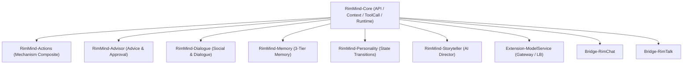
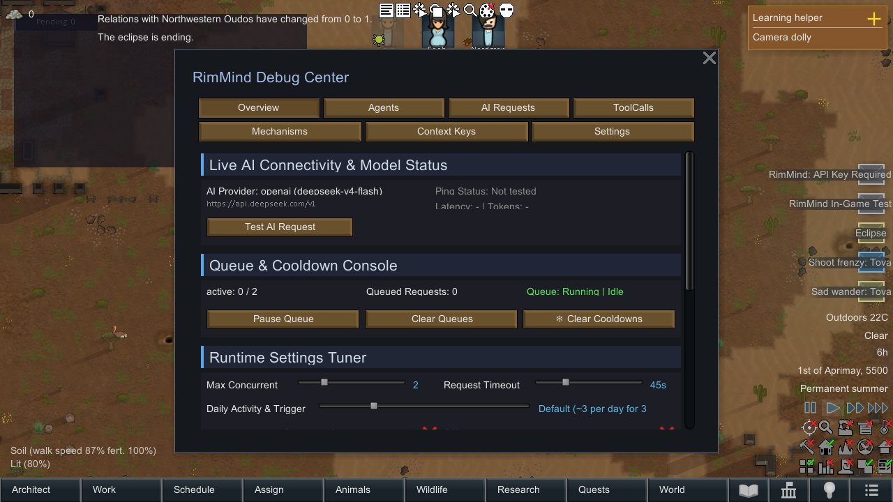

# RimMind - Core

RimMind 套件的核心基础设施，提供 LLM 客户端、异步请求队列和游戏上下文构建器，是所有 RimMind 子模组的前置依赖。

## RimMind 是什么

RimMind 是一套 AI 驱动的 RimWorld 模组套件，通过接入大语言模型（LLM），让殖民者拥有人格、记忆、对话和自主决策能力。

## 子模组列表与依赖关系

| 模组 | 职责 | 依赖 | GitHub |
|------|------|------|--------|
| **RimMind-Core** | 公共 API、LLM 请求调度、4-Zone 上下文引擎、ToolCall 契约与运行时 | Harmony | [链接](https://github.com/RimWorld-RimMind-Mod/RimWorld-RimMind-Mod-Core) |
| RimMind-Actions | 将基础 ToolCall 组合成高级 Mechanism 动作 | Core | [链接](https://github.com/RimWorld-RimMind-Mod/RimWorld-RimMind-Mod-Actions) |
| RimMind-Advisor | 状态/Thought → 建议、审批、动作与反馈闭环 | Core | [链接](https://github.com/RimWorld-RimMind-Mod/RimWorld-RimMind-Mod-Advisor) |
| RimMind-Dialogue | AI 驱动的对话系统与社交关系演进（express_dialogue） | Core | [链接](https://github.com/RimWorld-RimMind-Mod/RimWorld-RimMind-Mod-Dialogue) |
| RimMind-Memory | 三层记忆系统（情景/摘要/反思）与时间上下文 | Core | [链接](https://github.com/RimWorld-RimMind-Mod/RimWorld-RimMind-Mod-Memory) |
| RimMind-Personality | 基于概率的状态跃迁驱动的人格与 Thought 注入 | Core | [链接](https://github.com/RimWorld-RimMind-Mod/RimWorld-RimMind-Mod-Personality) |
| RimMind-Storyteller | AI 叙事者，智能评估戏剧性曲线与事件选择 | Core | [链接](https://github.com/RimWorld-RimMind-Mod/RimWorld-RimMind-Mod-Storyteller) |
| RimMind-Bridge-RimChat | RimMind 与 RimChat 模组的协调与门控互斥 | Core, RimChat | [链接](https://github.com/RimWorld-RimMind-Mod/RimWorld-RimMind-Mod-Bridge-RimChat) |
| RimMind-Bridge-RimTalk | RimMind 与 RimTalk 模组的对话气泡与上下文桥 | Core, RimTalk | [链接](https://github.com/RimWorld-RimMind-Mod/RimWorld-RimMind-Mod-Bridge-RimTalk) |
| RimMind-Extension-ModelService | 扩展模型网关、OpenCode Go 订阅直连与多端点负载均衡 | Core | [链接](https://github.com/RimWorld-RimMind-Mod/RimWorld-RimMind-Mod-Extension-ModelService) |



## 🎮 实机特性展示 / In-Game Showcase



- **F8 RimMind Hub 控制中枢**：游戏内随时按 `F8` 键唤起控制中心，查看实时 AI 请求队列、网络状态与并发配置。
- **4-Zone KV Cache 原生优化**：前缀稳定性达到 80%+，将易变环境（时间、天气）隔离在末尾，大幅降低 Token 消耗与计费。

## 安装步骤

### 从源码安装

**Linux/macOS:**
```bash
git clone git@github.com:RimWorld-RimMind-Mod/RimWorld-RimMind-Mod-Core.git
cd RimWorld-RimMind-Mod-Core
./script/deploy-single.sh <your RimWorld path>
```

**Windows:**
```powershell
git clone git@github.com:RimWorld-RimMind-Mod/RimWorld-RimMind-Mod-Core.git
cd RimWorld-RimMind-Mod-Core
./script/deploy-single.ps1 <your RimWorld path>
```

### 从 Steam 安装

1. 安装 [Harmony](https://steamcommunity.com/sharedfiles/filedetails/?id=2009463077) 前置模组
2. 安装 RimMind-Core
3. 按需安装其他 RimMind 子模组
4. 在模组管理器中确保加载顺序：Harmony → Core → 其他子模组

<!--  -->

## 快速开始

### 填写 API Key

1. 启动游戏，进入主菜单
2. 点击 **选项 → 模组设置 → RimMind-Core**
3. 选择 **AI Provider**（OpenAI 兼容 API 或 Player2）
4. 如果选择 OpenAI 兼容模式：
   - 填写你的 **API Key**
   - 填写 **API 端点**（见下方支持的端点列表）
   - 填写 **模型名称**（如 `deepseek-v4-flash`、`gpt-4o-mini`）
5. 如果选择 Player2 模式：
   - 安装 Player2 本地应用后可自动检测，无需手动配置
   - 也可手动填写 Player2 API Key 使用远程服务
6. 点击 **测试连接**，确认显示"连接成功"

<!--  -->

### 支持的 API 端点

| 服务 | 端点 | 说明 |
|------|------|------|
| DeepSeek | `https://api.deepseek.com/v1` | `deepseek-v4-flash`（默认） |
| OpenAI | `https://api.openai.com/v1` | GPT-4o-mini 等模型 |
| Ollama (本地) | `http://localhost:11434/v1` | 本地部署的模型 |
| Player2 | 自动检测 / 手动配置 | Player2 本地应用或远程 API |
| 其他 | 填入 Base URL | 任何 OpenAI 兼容接口 |

## 截图展示

<!--  -->
<!--  -->
<!--  -->

## 核心功能

开发入口见 [AGENTS.md](AGENTS.md)；上下文构建、缓存与测试地图见 [Context README](Source/Presentation/Context/README.md)。Core 全部测试项目累计少于 1000 个发现用例（参数化数据行逐个计数），以真实行为、失败边界和模块协作为准。

### LLM 客户端

兼容 OpenAI / DeepSeek / 本地 Ollama 等所有 OpenAI Chat Completions 格式的 API，同时支持 Player2 服务（本地应用自动检测 + 远程 API）。支持 JSON 强制模式（`response_format: json_object`），本地模型可关闭。

### 异步请求队列

所有 AI 请求在后台线程执行，不阻塞游戏主线程。每个请求独立冷却，过期请求自动丢弃。支持瞬态错误自动重试（timeout / 429 / 502 / 503 等），本地模型串行处理避免资源竞争。

### 上下文构建

自动采集游戏状态并打包为文本供各模块使用：

- **地图上下文**：时间、殖民者、食物、威胁、季节、天气
- **小人上下文**：年龄、背景、心情、健康、技能、装备、工作分配、关系

### 上下文过滤器

通过"上下文过滤"设置页精确控制哪些游戏信息注入 Prompt，节省 Token。提供最小/标准/完整三种预设，也可自定义勾选 28+ 个选项。

### Agent 认知架构

每个殖民者作为独立认知主体，遵循 Perceive→Think→Act→Record 循环：

- **Perceive**：5 个 Harmony Patch 将游戏事件（袭击、受伤、心情变化等）转为感知信号，经去重/优先级/冷却过滤后注入 Agent
- **Think**：Agent 根据感知信号和当前目标，通过 ContextEngine 构建上下文，向 LLM 发送结构化请求
- **Act**：解析 LLM 响应，执行工具调用（动作、对话、目标调整等）
- **Record**：记录行为到历史队列，用于后续决策参考

默认装配 Reactive / Proactive 模式，保留主动周期和感知触发。反思、日规划、梦境、社交组织与性格演化没有内置可用策略，不以空实现制造触发；其可选策略合同及 Verse 执行/生命周期完成检查仍保留。

### 统一 4-Zone 上下文引擎与 Prompt Caching (KV-Cache)

ContextEngine 采用针对现代大模型前缀缓存特化设计的 4-Zone 分层拓扑，前缀跨轮多 Tick 100% 字节不变，预估缓存命中率达 80%~90%：

- **Zone 1 (Static System Instructions)**：L0 系统指令与通用规范，全局静态，永久锁定在前缀最前端（100% 命中）。
- **Zone 2 (Pawn Profiles)**：L1 殖民者持久画像、背景故事、特质与技能，只要角色未发生剧烈变动即保持跨轮字节一致。
- **Zone 3 (Monotonic Histories)**：L4 对话记录、近期事件流与记忆摘要，按时间戳确定性严格单调追加，绝不产生历史乱序。
- **Zone 4 (Volatile Observations Tail)**：L2/L3/L5 动态易变环境（当前游戏时间、动态天气、即时心情、生理伤痛及周围 Sensor 信号），严格隔离在消息尾部，彻底杜绝易变数据对前置长缓存的击穿。
- **确定性字典序**：条目与 Tool 声明均按字典序排序，保证跨帧序列化字节完全一致。

快照构建统一走 `BuildSnapshotFromEnvelopeAsync`，支持异步 Provider、取消、缓存失效和历史/预算处理；不再提供只执行同步 Provider 的平行构建入口。

### 数据飞轮

内置自动调优系统（Flywheel），持续分析 AI 请求效果并优化上下文参数，让 AI 输出质量随使用时间逐步提升。

### 现代化调试中心 (RimMind Hub) 与观测台

按快捷键或通过开发者菜单可随时呼出 RimMind 调试中心与全链路报文检查器：

- **实时 LLM 连通性测试台**：一键发起异步测速探针，实时显示 HTTP 状态码、RTT 延迟、Token 消耗与返回内容/错误详情。
- **请求队列与冷却控制台**：一键暂停/恢复全局队列、清空积压请求、重置各模块冷却时间。
- **运行时参数微调**：实时无缝调节最大并发数、超时时间、详细日志开关。
- **殖民者 Agent 观测器**：实时查看殖民者认知状态、一键触发即时思考（Trigger Agent Tick）。
- **报文检查器 (ContextPayloadInspector)**：全景可视化 4-Zone 结构，审查每个 Zone 的 Token 占比、KV-Cache 稳定性评分与次轮预估命中率。
- **智能收缩悬浮窗 (RequestOverlay)**：待审批时展开审批卡片，无请求时自动收缩为视口边缘的轻量迷你胶囊 `[Pending: 0]`。

### 调试工具

- **AI Debug Log**：浮动窗口，查看每次 AI 调用的完整 Prompt + Response
- **请求悬浮窗**：右下角实时显示 AI 请求状态
- **Dev 菜单**：测试连接、查看上下文、清除冷却、暂停/恢复队列等

## 设置项

| 设置 | 默认值 | 说明 |
|------|--------|------|
| AI Provider | OpenAI | 选择 OpenAI 兼容 API 或 Player2 |
| API Key | - | 你的 API 密钥（Player2 模式可选） |
| API 端点 | `https://api.deepseek.com/v1` | OpenAI 兼容端点 |
| 模型名称 | `deepseek-v4-flash` | 任意模型 ID |
| 强制 JSON 模式 | 开启 | 不支持的本地模型请关闭 |
| 最大 Token | 800 | 响应长度上限（200-2000） |
| 默认温度 | 0.7 | 控制输出随机性（0.0-2.0） |
| 最大并发请求数 | 3 | 同时发送请求的上限（1-10） |
| 最大重试次数 | 2 | 请求失败后重试次数（0-5） |
| 请求超时 | 120秒 | 等待 AI 响应的最大时间（10-300秒） |
| 详细日志 | 关闭 | 输出到 Player.log |
| 请求悬浮窗 | 开启 | 右下角显示请求状态 |
| 自定义人物提示词 | 空 | 追加在人物上下文末尾 |
| 自定义地图提示词 | 空 | 追加在地图上下文末尾 |
| 上下文过滤器 | 标准 | 28+ 个可选项，三种预设 |
| 上下文 Diff 生存期 | 3000 ticks | Diff 条目过期时间（300-3000） |
| 上下文校准间隔 | 30000 ticks | 基线重算间隔（5000-60000） |
| 飞轮自动应用 | 关闭 | Off / LogOnly / ApplyWithLog |
| 飞轮置信度阈值 | 0.8 | 自动应用最低置信度（0.5-1.0） |

## 常见问题

**Q: 支持哪些大模型？**
A: 任何兼容 OpenAI Chat Completions API 的模型均可使用，包括 OpenAI GPT 系列、DeepSeek、本地 Ollama 等。同时支持 Player2 服务（本地应用自动检测 + 远程 API）。

**Q: 会不会影响游戏帧率？**
A: 不会。所有 AI 请求在后台线程执行，主线程只处理回调结果。

**Q: API Key 安全吗？**
A: API Key 仅存储在本地 RimWorld 设置文件中，不会上传到任何服务器。

**Q: 不填 API Key 会怎样？**
A: Core 本身不会报错，但所有依赖 AI 的子模组功能将无法工作。

**Q: 推荐用什么模型？**
A: 默认推荐 `deepseek-v4-flash`，兼顾价格与响应速度。本地 Ollama 用户可使用 `qwen2.5:7b` 等模型。

## 致谢

本项目开发过程中参考了以下优秀的 RimWorld 模组：

- [RimTalk](https://github.com/jlibrary/RimTalk.git) - 对话系统参考
- [RimTalk-ExpandActions](https://github.com/sanguodxj-byte/RimTalk-ExpandActions.git) - 动作扩展参考
- [NewRatkin](https://github.com/solaris0115/NewRatkin.git) - 种族模组架构参考
- [VanillaExpandedFramework](https://github.com/Vanilla-Expanded/VanillaExpandedFramework.git) - 框架设计参考

## 贡献

欢迎提交 Issue 和 Pull Request！如果你有任何建议或发现 Bug，请通过 GitHub Issues 反馈。


---

# RimMind - Core (English)

The core infrastructure of the RimMind suite, providing LLM client, async request queue, and game context builder. Required by all other RimMind modules.

## What is RimMind

RimMind is an AI-driven RimWorld mod suite that connects to Large Language Models (LLMs), giving colonists personality, memory, dialogue, and autonomous decision-making.

## Sub-Modules & Dependencies

| Module | Role | Depends On | GitHub |
|--------|------|------------|--------|
| **RimMind-Core** | Public API, LLM scheduling, 4-Zone context engine, ToolCall contracts & runtime | Harmony | [Link](https://github.com/RimWorld-RimMind-Mod/RimWorld-RimMind-Mod-Core) |
| RimMind-Actions | High-level Mechanism composite actions from atomic ToolCalls | Core | [Link](https://github.com/RimWorld-RimMind-Mod/RimWorld-RimMind-Mod-Actions) |
| RimMind-Advisor | Thought/Status → advice, player approval, action & feedback loop | Core | [Link](https://github.com/RimWorld-RimMind-Mod/RimWorld-RimMind-Mod-Advisor) |
| RimMind-Dialogue | Context-aware AI dialogue & social relationship dynamics (express_dialogue) | Core | [Link](https://github.com/RimWorld-RimMind-Mod/RimWorld-RimMind-Mod-Dialogue) |
| RimMind-Memory | 3-tier memory system (Episodic/Summary/Reflection) & temporal context | Core | [Link](https://github.com/RimWorld-RimMind-Mod/RimWorld-RimMind-Mod-Memory) |
| RimMind-Personality | Probabilistic state-transition driven personality & Thought injection | Core | [Link](https://github.com/RimWorld-RimMind-Mod/RimWorld-RimMind-Mod-Personality) |
| RimMind-Storyteller | AI storyteller, dynamic dramatic tension & incident selection | Core | [Link](https://github.com/RimWorld-RimMind-Mod/RimWorld-RimMind-Mod-Storyteller) |
| RimMind-Bridge-RimChat | Coordination & mutual exclusion layer with RimChat mod | Core, RimChat | [Link](https://github.com/RimWorld-RimMind-Mod/RimWorld-RimMind-Mod-Bridge-RimChat) |
| RimMind-Bridge-RimTalk | Dialogue bubbles & context bridge with RimTalk mod | Core, RimTalk | [Link](https://github.com/RimWorld-RimMind-Mod/RimWorld-RimMind-Mod-Bridge-RimTalk) |
| RimMind-Extension-ModelService | Extended model gateway, OpenCode Go subscription & multi-endpoint load balancing | Core | [Link](https://github.com/RimWorld-RimMind-Mod/RimWorld-RimMind-Mod-Extension-ModelService) |

## 🎮 In-Game Showcase


- **F8 RimMind Hub**: Open the live control hub anytime with `F8` to inspect AI queue state, round-trip latency, and runtime concurrency limits.
- **4-Zone KV Cache Optimization**: Isolates volatile environment data (time, weather) to the tail of the payload, achieving 80%+ prefix stability and drastically cutting token costs.

## Installation

### Install from Source

**Linux/macOS:**
```bash
git clone git@github.com:RimWorld-RimMind-Mod/RimWorld-RimMind-Mod-Core.git
cd RimWorld-RimMind-Mod-Core
./script/deploy-single.sh <your RimWorld path>
```

**Windows:**
```powershell
git clone git@github.com:RimWorld-RimMind-Mod/RimWorld-RimMind-Mod-Core.git
cd RimWorld-RimMind-Mod-Core
./script/deploy-single.ps1 <your RimWorld path>
```

### Install from Steam

1. Install [Harmony](https://steamcommunity.com/sharedfiles/filedetails/?id=2009463077)
2. Install RimMind-Core
3. Install other RimMind sub-modules as needed
4. Ensure load order: Harmony → Core → other sub-modules

## Quick Start

### API Key Setup

1. Launch the game, go to main menu
2. Click **Options → Mod Settings → RimMind-Core**
3. Select **AI Provider** (OpenAI-compatible API or Player2)
4. If using OpenAI-compatible mode:
   - Enter your **API Key**
   - Enter your **API Endpoint** (see supported endpoints below)
   - Enter your **Model Name** (e.g., `deepseek-v4-flash`, `gpt-4o-mini`)
5. If using Player2 mode:
   - Install Player2 local app for automatic detection, no manual configuration needed
   - Or manually enter a Player2 API Key for remote service
6. Click **Test Connection** and confirm "Connection Successful"

### Supported API Endpoints

| Service | Endpoint | Notes |
|---------|----------|-------|
| DeepSeek | `https://api.deepseek.com/v1` | `deepseek-v4-flash` (default) |
| OpenAI | `https://api.openai.com/v1` | GPT-4o-mini etc. |
| Ollama (local) | `http://localhost:11434/v1` | Locally deployed models |
| Player2 | Auto-detect / Manual | Player2 local app or remote API |
| Others | Enter Base URL | Any OpenAI-compatible API |

## Key Features

- **LLM Client**: Compatible with OpenAI / DeepSeek / local Ollama and any OpenAI Chat Completions API, plus Player2 service (local app auto-detect + remote API)
- **Async Request Queue**: All AI requests run on background threads, never blocking the game. Supports automatic retry for transient errors (timeout / 429 / 502 / 503 etc.), serial processing for local models
- **Context Builder**: Automatically collects game state (colonist stats, map info, etc.) for AI prompts
- **Context Filter**: Fine-grained control over what game info gets sent to AI, with Minimal/Standard/Full presets and 28+ configurable options
- **Agent Cognitive Architecture**: Each colonist as an independent cognitive agent following Perceive→Think→Act→Record cycle, with perception bridge (5 Harmony Patches) converting game events into perception signals
- **Unified Context Engine**: L0-L5 layered context building with Diff injection and tick-based expiry, BudgetScheduler scoring (W1×priority + W2×relevance), extensible via ContextKeyRegistry
- **Data Flywheel**: Built-in auto-tuning system that continuously analyzes AI request quality and optimizes context parameters
- **Debug Tools**: AI Debug Log window, request overlay, Dev menu actions (test connection, view context, clear cooldowns, pause/resume queue)

## FAQ

**Q: Which models are supported?**
A: Any model compatible with the OpenAI Chat Completions API, including OpenAI GPT, DeepSeek, and local Ollama. Also supports Player2 service (local app auto-detect + remote API).

**Q: Will it affect game FPS?**
A: No. All AI requests run on background threads; the main thread only processes callbacks.

**Q: Is my API Key safe?**
A: The API Key is stored locally in RimWorld settings files and never uploaded to any server.

**Q: What if I don't fill in an API Key?**
A: Core itself won't error, but all AI-dependent sub-module features will be unavailable.

**Q: What model do you recommend?**
A: `deepseek-v4-flash` is the default recommendation for a good balance of cost and speed. Ollama users can try `qwen2.5:7b`.

## Acknowledgments

This project references the following excellent RimWorld mods:

- [RimTalk](https://github.com/jlibrary/RimTalk.git) - Dialogue system reference
- [RimTalk-ExpandActions](https://github.com/sanguodxj-byte/RimTalk-ExpandActions.git) - Action expansion reference
- [NewRatkin](https://github.com/solaris0115/NewRatkin.git) - Race mod architecture reference
- [VanillaExpandedFramework](https://github.com/Vanilla-Expanded/VanillaExpandedFramework.git) - Framework design reference

## Contributing

Issues and Pull Requests are welcome! If you have any suggestions or find bugs, please feedback via GitHub Issues.
