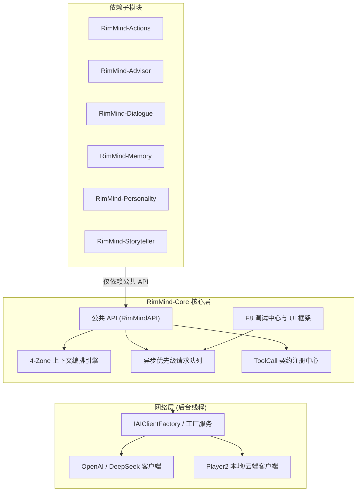

<div align="center">

# RimMind-Core 🧠
### 专为 RimWorld 1.6 打造的底层大模型运行时、上下文编排与 ToolCall 框架

[English](README.md) | **简体中文**

<p>
  <a href="https://rimworldgame.com/"></a>
  <a href="https://github.com/pardeike/Harmony"></a>
  <a href="https://dotnet.microsoft.com/"></a>
  <a href="#"></a>
  <a href="#"></a>
  <a href="LICENSE"></a>
</p>

<p><em>RimMind 智能体生态的核心技术基石。</em></p>

</div>

---

## 📖 模块概览

**RimMind-Core** 为整个 RimMind 模组套件提供底层 AI 基础设施与运行时环境。所有玩法子模组（`Actions`、`Advisor`、`Dialogue`、`Memory`、`Personality`、`Storyteller` 以及生态桥接模组）均严格且仅依赖 `RimMind-Core` 的公开公共 API。

### 核心特性
- **4-Zone KV-Cache 深度前缀优化**：将不变的世界观规则（Zone 1）与小人永久档案（Zone 2）固定在前缀，将历史（Zone 3）与易变的环境时间天气（Zone 4）隔离在报文末尾，实现 80%+ 的前缀缓存命中率。
- **异步优先级请求队列**：纯后台线程执行 HTTP/JSON 请求，支持指数退避重试、高频节流，主线程安全消费 Unity/Verse 副作用。
- **原生 ToolCall 契约注册中心**：强类型工具定义、JSON Schema 校验与结构化工具分发，彻底杜绝 Markdown 格式解析错误。
- **F8 游戏内开发者中枢**：按 `F8` 随时呼出控制中心，支持毫秒级端点测速、队列暂停/清空、冷却重置与报文检视。

---

## 🎮 实机特性展示


*游戏内 F8 调试中心界面：玩家与开发者可实时测试 AI 连通性、观察 Token 前缀缓存效率，并平滑微调并发参数。*

---

## 🏛️ 系统架构与单向依赖



---

## 🛠️ 安装与模组加载顺序

在 RimWorld 模组管理器中，确保 `RimMind-Core` 紧随 Harmony 和原版 Core 加载：

```text
1. Harmony
2. Core (RimWorld 原版)
3. RimMind-Core
4. [其他 RimMind 子模组，按需任意组合启用]
```

---

## ⚙️ 核心设置项

位于 **选项 -> Mod 设置 -> RimMind-Core**：

| 设置项 | 默认值 | 说明 |
|---|---|---|
| **AI Provider** | `openai` | 支持 OpenAI 兼容端点、DeepSeek 与 Player2 服务 |
| **API 端点** | `https://api.deepseek.com/v1` | OpenAI Chat Completions 兼容端点 URL |
| **模型名称** | `deepseek-chat` | 目标大语言模型标识符 |
| **最大并发请求数** | `3` | 同时发送给大模型的请求上限（1~10） |
| **请求超时** | `60秒` | 等待 AI 响应的最大超时时限（10~180秒） |
| **请求悬浮窗** | `开启` | 屏幕右下角实时显示请求处理状态与迷你胶囊 |
| **详细调试日志** | `关闭` | 输出完整报文跟踪日志至 `Player.log` |

---

## 🧪 开发者测试指南

在仓库根目录下运行单元测试与架构守护契约测试：

```powershell
# 运行全部单元测试
dotnet test RimMind-Core/Tests/RimMindCore.Tests.csproj -c Release

# 运行架构守卫契约测试
dotnet test RimMind-Core/ArchTests/RimMindCore.ArchTests.csproj -c Release
```

---

## 📜 开源协议

本项目采用 [MIT License](LICENSE) 开源许可证。
